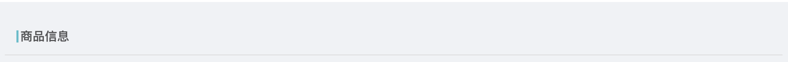

# 分销控制台

## 第三方库

- `dva` 数据流动，[文档地址](https://dvajs.com/guide/)

- `umi-request` 网络请求，[文档地址](https://github.com/umijs/umi-request/blob/master/README_zh-CN.md)

## 项目编写

### 运行

拉取项目至本地后，通过命令 `yarn && yarn start` 运行项目

### 代码结构

- `src/components` 全局组件

- `src/models` 全局 model 所在目录

- `src/pages` 页面；它按照菜单的层级去组织代码的目录结构，每个页面的文件大致如下：

  - `_mock.js` 本地 mock 数据的文件，具体规则参见 [文档](https://umijs.org/zh/guide/mock-data.html)

  - `index.js` 当前页面的入口文件，如果页面很复杂，请酌情拆分文件，放在同一个文件夹下

  - `model.js` 当前页面的 model，存储 `state`、`reducer`、`effects`

  - `service.js` 数据获取文件，一般用于当前页面接口调用，由 `model` 中 `effects` 里的方法调用

  - `style.less` 样式文件

- `src/pages/document.ejs` `index.html` 的自定义模块文件

- `src/services` 全局 service

- `src/utils` 工具类

### 编写代码注意事项

- 请在编辑器中调整好 eslint 工具的提示问题，确保能实时观察到 eslint 错误与警告

- 请设置好编辑器对 `.editorconfig` 的支持

- 推荐将编辑工具的显示字体调整为等宽字体，以方便对齐代码

- 请勿私自添加 `dependencies`，如有需要，提出问题讨论后决定

### 公共组件

- Breadcrumb

  ```jsx
  <Breadcrumb title="商品信息" />
  ```



- ImageView

  ```jsx
  <ImageView images={[]} onChange={images => dealWith(images)} total={4} />

  // 需要注意的是，images 在传入之前需要更改形式，参数形式如下：
  [
    {
      id: 'uuid', // 唯一标识,
      local: '', // 本地 URL，一般不用管
      server: '', // 图片 url，这是上传 oss 后获得的地址
      status: 'done|none|uploading', // 图片状态，一般也不用管
    },
  ]

  // 所以，如果拿到一个  [ 'https://path/to/imags.jpg' ] 数组，需要进行如下转换：
  images = images.map(it => ({ id: uuid(), server: it }));
  // 如果提交服务器，需要进行如下转换
  images = images.filter(it => it.server).map(it => it.server);
  ```

- FormItem

  ```jsx
  <FormItem
    label="标题"
    require     // 是否标记 *
    value       // 默认使用输入框，这是它的受控属性
  />

  <FormItem label="Other label">
    <Select><Option>Option</Option></Select>   <!-- 也可以自定义输入框的形式 -->
  </FormItem>
  ```

- CoverImage  封面图片

  ```jsx
  <CoverImage
    src="${url}"                    // 图片的URL路径
    display="fit | contain | cover" // 展示方式： fit - 等比缩放后，最短边铺满，居中展示，超出隐藏；contain - 等比缩放后，最长边铺满，居中展示； cover - 拉伸铺满
    className=""                    // 样式添加到组件容器上
    style={{}}                      // 样式添加到组件容器上
  />

  注意：
  1.className或style中指定容器宽高。否则无法计算缩放规则。
  2.组件内部包含DOM计算，大量列表渲染时，请做好分批加载。
  ```

- global.less .GMLL 多行/单行超出省略号
  示例：
  ```jsx
  <CoverImage
    className={`${styles.cover} GMLL-N`}                    // 样式添加到组件容器上
  />

  注意：
    元素需要自己定义好高度和文字行高。GMLL-1: 单行超出省略；GMLL-2：2行超出省略，目前只到GMLL-4，其他自行添加
  ```

- CheckAbleList 组件说明
  属性：
  const { data = [], scrollAble = true, useDiliver = false, style = {}, className = '', itemClassName = '', itemStyle = {}, checkedClassName = '' } = props;

  ```jsx
  
  <CheckAbleList
    className                       // 添加到容器元素
    data={[{text: '',checked: true  ,value: ''}]}  // 渲染的列表数据，受控：列表改变后需要回传更新后数据
    scrollAble                      // 是否支持横向滚动，默认支持
    useDiliver                      // 各选项是否使用分割线隔开默认不使用
    itemClassName                   // 各选项自定义样式
    itemStyle                       // 各选项自定义样式
    checkedClassName                // 各选项被选中样式
    multiple                        // 是否多选，默认false
    onChange                        // 选项改变时回调，入参（value|values，newData）;newData,可以直接更新到model的state中去。
  />

  注意：
    组件OptionSelect和CatelogSelect  都是基于此组件的样式封装。
  ```